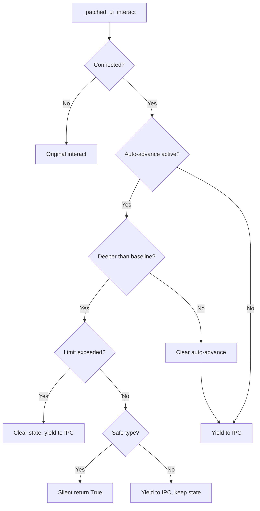
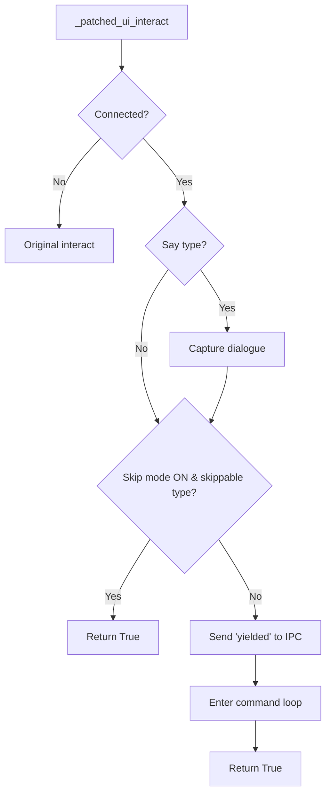
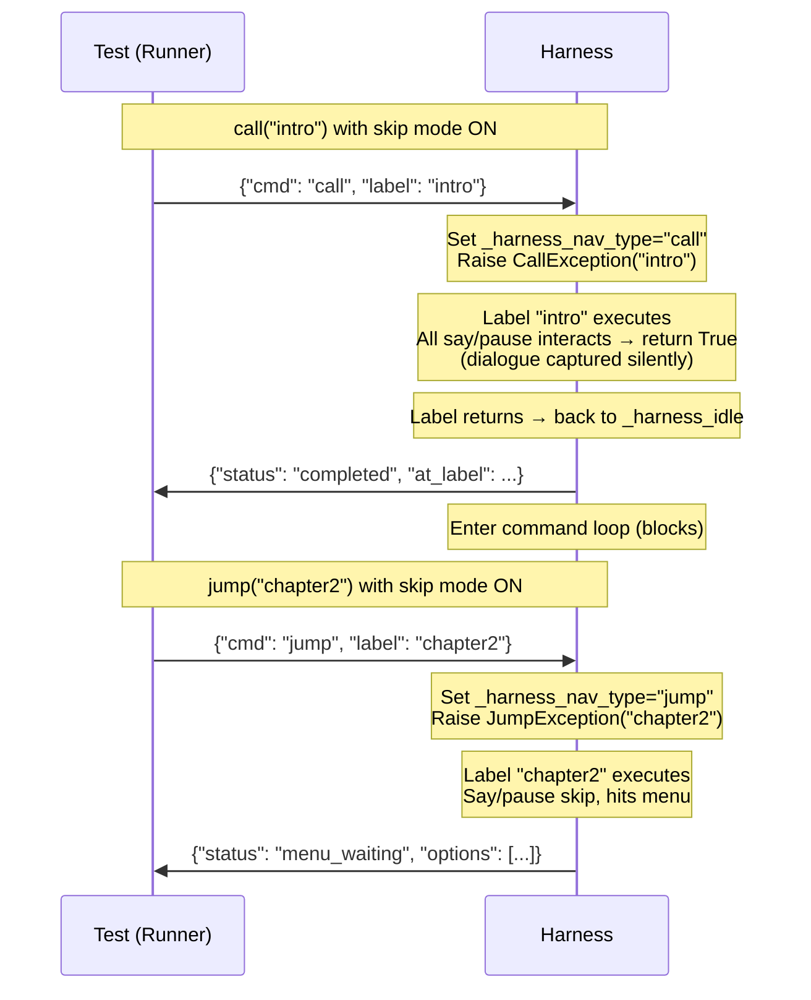

# Layer 2 DX Improvements

## Overview

Replace the auto-advance depth-tracking system with a uniform skip mode, add dialogue capture for asserting on game text, improve error messages across the IPC boundary, and make the `renpy_engine` fixture auto-discover the SDK. These four feature groups address the top adoption blockers identified after building 131 integration tests across two Ren'Py games.

Session reuse (R18-R21) is deferred to a separate future plan due to high implementation risk and dependency on Ren'Py store-default investigation. Per-file project path (R12) is simplified to documenting conftest fixture override.

## Problem Frame

After building full integration test suites for Kid and King (78 tests) and Forest's Bane (53 tests), five pain points emerged. The auto-advance depth-tracking system baked into `call()` caused 62 test failures from semantic confusion with Ren'Py's native `call`/`jump` distinction. Tests cannot assert on dialogue content. The fixture requires undiscoverable CLI flags. Error messages are cryptic across the IPC boundary. (see origin: `docs/brainstorms/2026-05-07-layer2-dx-improvements-requirements.md`)

## Requirements Trace

- R1. Replace depth-tracking with clean skip mode; decouple skip from call/jump
- R2. Skip mode enabled by default; both `jump()` and `call()` skip say/pause interactions
- R3. `call()` = push return stack, `jump()` = go there; neither implies fast-forward
- R4. `set_skip(False)` enables stepping mode; `set_skip(True)` re-enables skip
- R5. Remove 100-interaction limit and depth-tracking code
- R6. Harness accumulates dialogue (who + what) during execution
- R7. `get_dialogue()` returns full accumulated log
- R8. `get_last_dialogue()` returns most recent say
- R9. `clear_dialogue()` clears the log
- R10. Dialogue capture works regardless of skip mode
- R11. Fixture auto-discovers SDK via `RENPY_SDK_PATH` env var, then common paths
- R12. Document conftest-level fixture override for project path (simplified from per-file marker)
- R14. `select_menu()` with no active menu raises clear error
- R15. Game crash includes game-side traceback
- R16. Timeout errors name the pending operation
- R17. `eval_expr`/`exec_code` errors include game-side traceback

## Scope Boundaries

- No changes to Layer 1 (mock-based unit testing)
- No GUI or visual testing — dialogue capture is text-only
- No parallel test execution within a single engine process
- SDK auto-discovery covers Linux and macOS; Windows is deferred
- No changes to IPC wire format — new commands use existing JSON-over-socket protocol
- No session reuse (R18-R21) — deferred to separate plan

### Deferred to Separate Tasks

- Session reuse (`reset()`, fixture-level toggle): separate plan after skip mode ships
- Per-file project path via pytest marker: conftest override covers the need; marker is future work if demand appears

## Context & Research

### Relevant Code and Patterns

- `src/pytest_renpy/engine/_test_harness.rpy` — harness injected into Ren'Py at `init -999`; patches `ui.interact`, `display_menu`, `with_statement`; contains `_harness_command_loop()` and `_harness_idle` label
- `src/pytest_renpy/engine/runner.py` — `RenpyEngine` class; `jump()`, `call()`, `advance()`, `select_menu()`, `get_store()`, `eval_expr()`, `exec_code()`
- `src/pytest_renpy/engine/ipc.py` — `IPCServer` (pytest side) and `IPCClient`; Unix domain socket, JSON-lines protocol
- `src/pytest_renpy/fixtures.py` — `renpy_engine` fixture (lines 71-99); reads `--renpy-sdk` and `--renpy-project` CLI options
- `src/pytest_renpy/plugin.py` — pytest plugin registration; `pytest_addoption` for CLI flags

### Institutional Learnings

- The depth-tracking auto-advance system was built in the call-stack fix plan and abandoned as too complex — it entangled skip behavior with call/jump semantics, causing 62 test failures (docs/brainstorms/2026-05-07-layer2-dx-improvements-requirements.md)
- `CallException` requires `from_current=True` in Ren'Py 8.3.7 so the return site is the current node (docs/investigations/2026-05-07-renpy-call-and-mid-label-yields.md)
- `_harness_idle` recursive self-call grows the Ren'Py call stack unboundedly — noted as tech debt (same investigation)
- `_patched_ui_interact` always returns `True`; Ren'Py passes `type=` keyword indicating interaction kind (`"say"`, `"pause"`, `"menu"`, `"input"`)
- `_last_say_who` and `_last_say_what` on `renpy.store` should be set before `ui.interact` for say-type interactions — needs verification during implementation (origin doc dependency)

## Key Technical Decisions

- **Skip mode as a flag, not depth tracking**: A single `_harness_skip_mode` boolean replaces all depth-tracking state (`_harness_auto_advance_depth`, `_harness_pending_call_response`, `_harness_auto_advance_count`, safe-type set, limit constant). When True (default), say/pause interacts return immediately. When False, every interact yields to IPC. This is simpler, matches Ren'Py's own skip concept, and decouples skip from navigation verbs.

- **Navigation response via `_harness_idle` re-entry**: After navigation with skip mode ON, execution runs through all say/pause interacts without IPC round-trips. The test receives a response when execution pauses at a menu (`menu_waiting` from `_patched_display_menu`) or returns to `_harness_idle` (`completed` for call, `yielded` for jump). A single `_harness_nav_type` variable tracks the active navigation: `None` (no navigation), `"call"` (call in progress), or `"jump"` (jump in progress). `_patched_display_menu` clears `_harness_nav_type` before sending `menu_waiting` to prevent a duplicate response when `_harness_idle` is later reached.

- **Keep recursive `_harness_idle` with cascade catcher**: The recursive `call _harness_idle from _harness_idle_return` pattern is retained (not replaced with `jump _harness_idle`) because JumpException does NOT modify the return stack — it only changes the current execution node. When a jumped-to label finishes, execution returns through the existing return stack and cascades back into `_harness_idle`. With a jump loop, there would be no return-stack entry to catch this cascade, breaking the idle loop. Instead, add a **post-call cascade catcher** in the `_harness_idle` label: after the recursive `call _harness_idle` returns, check `_harness_nav_type` — if it's set (meaning a navigation just completed via cascade), send the appropriate response (`completed` or `yielded`), clear the flag, and re-enter the command loop. The unbounded stack growth remains as accepted tech debt until session reuse work provides a natural fix point.

- **Dialogue capture at interact hook**: `_patched_ui_interact` reads `renpy.store._last_say_who` / `_last_say_what` on every say-type interact, regardless of skip mode. If verification shows these aren't reliably set for all say types (narrator, NVL), the fallback is patching `renpy.exports.say` or `Character.__call__`.

- **Skippable interact types**: `{"say", "pause"}`. The `with` type is already handled by `_noop_with`. Menus are handled by `_patched_display_menu` (always yields). Unknown types yield to IPC as a safety net.

- **Fixture SDK discovery order**: `--renpy-sdk` CLI flag (explicit override) → `RENPY_SDK_PATH` env var (default) → skip test. CLI flags take priority over environment variables, following standard CLI conventions. Common-path scanning (e.g., `~/tools/renpy-*-sdk/`) deferred — env var is the primary auto-discovery mechanism and is sufficient for CI and developer workflows.

## Open Questions

### Resolved During Planning

- **Should session reuse be deferred?** Yes — deferred to separate plan. Lower adoption impact, higher implementation risk than the other four groups.
- **Per-file project path mechanism?** Simplified to conftest fixture override. Most developers test one game; multi-project dispatch via separate pytest invocations or conftest overrides.
- **What SDK paths to auto-discover?** `--renpy-sdk` CLI flag (highest priority) → `RENPY_SDK_PATH` env var → skip. CLI flags override env vars per standard convention. Common-path scanning deferred.

### Deferred to Implementation

- **Are `_last_say_who` / `_last_say_what` reliably set for narrator, NVL, and Character says?** Verify empirically during dialogue capture implementation. Fallback: patch `renpy.exports.say` or `Character.__call__`.
- **Cascade depth with recursive `_harness_idle`**: The recursive `call _harness_idle` pattern causes unbounded call stack growth over the engine's lifetime. Accepted as tech debt for now — session reuse (deferred) will provide a natural reset point. Monitor for stack depth issues in long-running test suites.
- **Example test migration impact**: Existing Kid/King and Bekri tests use `call()` with auto-advance semantics. With skip mode, `call()` returns `completed` only after the entire label finishes (not at first interact). Tests relying on intermediate yields from `call()` will need adjustment. Assess migration scope during Unit 1 implementation.

## High-Level Technical Design

> *This illustrates the intended approach and is directional guidance for review, not implementation specification. The implementing agent should treat it as context, not code to reproduce.*

### `_patched_ui_interact` — Before vs After

**Current** (depth-tracking entangled with skip):

**After** (clean skip mode):

### Navigation + Idle Loop Flow

## Implementation Units

- [ ] **Unit 1: Native Skip Mode**

**Goal:** Replace depth-tracking auto-advance with a uniform skip mode flag. Both `call()` and `jump()` skip through say/pause interactions by default. Add `set_skip()` for toggling between skip and step modes.

**Requirements:** R1, R2, R3, R4, R5

**Dependencies:** None

**Files:**
- Modify: `src/pytest_renpy/engine/_test_harness.rpy`
- Modify: `src/pytest_renpy/engine/runner.py`
- Test: `tests/test_skip_mode.py`

**Approach:**

Harness side (`_test_harness.rpy`):
- Remove: `_harness_auto_advance_depth`, `_harness_pending_call_response`, `_harness_auto_advance_count`, `_HARNESS_SAFE_AUTO_ADVANCE_TYPES`, `_HARNESS_AUTO_ADVANCE_LIMIT`, `_harness_clear_auto_advance()`
- Add: `_harness_skip_mode = True`, `_harness_nav_type = None` (values: `None`, `"call"`, `"jump"`)
- Add: `_HARNESS_SKIPPABLE_TYPES = {"say", "pause"}`
- Add: `_HARNESS_SKIP_LIMIT = 10000` — configurable safety limit replacing the removed 100-interaction limit; prevents infinite loops in game code from spinning the harness forever
- Simplify `_patched_ui_interact`: if `_harness_skip_mode` and interact type in skippable set → return True. Otherwise → send `yielded`, enter command loop, return True. When skip limit is hit, yield to IPC with a `skip_limit` flag in the response
- Add `set_skip` command to `_harness_command_loop`: updates `_harness_skip_mode`, sends `{"status": "ok"}`
- Simplify `call` handler: set `_harness_nav_type = "call"`, raise `CallException`
- Update `jump` handler: set `_harness_nav_type = "jump"`, raise `JumpException`
- Update `_patched_display_menu`: clear `_harness_nav_type = None` before sending `menu_waiting` to prevent duplicate response when `_harness_idle` is later reached via cascade
- Update `_harness_idle`: keep recursive `call _harness_idle from _harness_idle_return` pattern. Add post-call cascade catcher: after the recursive call returns, check `_harness_nav_type` — if `"call"`, send `completed` + clear; if `"jump"`, send `yielded` + clear. Then re-enter command loop
- Update `exec` handler's `CallException` catch: set `_harness_nav_type = "call"` instead of old depth-tracking variables

Runner side (`runner.py`):
- Add `set_skip(self, enabled: bool)` method: sends `{"cmd": "set_skip", "enabled": enabled}`, validates `ok` response
- `call()` and `jump()` remain structurally the same — they send the command, call `_recv_navigation()`, return `NavigationResult`. The protocol change is transparent: with skip mode, the response arrives later (after all says skip) but the response format is unchanged (`yielded`, `completed`, or `menu_waiting`)

**Patterns to follow:**
- Existing `get_store`/`set_store` command pattern for `set_skip` in `_harness_command_loop`
- Existing `NavigationResult` dataclass for return types

**Test scenarios:**
- Happy path: `jump()` to label with say statements, skip mode ON → response received (not `yielded` at first say as before, but `yielded` or `menu_waiting` when execution pauses)
- Happy path: `call()` to label that returns → `completed` response with no intermediate yields
- Happy path: `jump()` to label with menu → says skip, `menu_waiting` at menu
- Happy path: `call()` to label with menu → says skip, `menu_waiting` at menu
- Happy path: `set_skip(False)` → `advance()` steps through individual say statements (each yields to IPC)
- Happy path: `set_skip(True)` after stepping → back to skipping behavior
- Edge case: `call()` to label that calls another label internally → inner call returns, outer continues, eventual `completed`
- Edge case: multiple sequential navigation commands → each gets correct response
- Integration: existing Kid/King test patterns produce equivalent results (jump to label, check store, select menu)

**Verification:**
- All existing integration tests pass with skip mode (behavior should be functionally identical for tests that don't use `set_skip`)
- `set_skip(False)` causes interacts to yield individually; `set_skip(True)` resumes batch skipping
- No depth-tracking code remains in `_test_harness.rpy`

---

- [ ] **Unit 2: Dialogue Capture**

**Goal:** Accumulate say-statement dialogue (who + what) during execution. Provide API methods to retrieve and clear the dialogue log.

**Requirements:** R6, R7, R8, R9, R10

**Dependencies:** Unit 1 (skip mode refactor — dialogue capture hooks into the simplified `_patched_ui_interact`)

**Files:**
- Modify: `src/pytest_renpy/engine/_test_harness.rpy`
- Modify: `src/pytest_renpy/engine/runner.py`
- Test: `tests/test_dialogue_capture.py`

**Approach:**

Harness side (`_test_harness.rpy`):
- Add `_harness_dialogue_log = []` global
- In `_patched_ui_interact`, when interact type is `"say"`: read `renpy.store._last_say_who` and `renpy.store._last_say_what`, append `{"who": who, "what": what}` to `_harness_dialogue_log`. Do this BEFORE the skip/yield decision so dialogue is captured regardless of skip mode.
- If `_last_say_who`/`_last_say_what` are not reliably available (verify during implementation), fall back to patching `renpy.exports.say` or `Character.__call__` to capture dialogue before the interact call.
- Add two commands to `_harness_command_loop`:
  - `get_dialogue`: sends `{"status": "ok", "dialogue": _harness_dialogue_log}`
  - `clear_dialogue`: resets `_harness_dialogue_log = []`, sends `{"status": "ok"}`

Runner side (`runner.py`):
- Add `get_dialogue(self) -> list[dict[str, str]]`: sends `get_dialogue` command, returns list of `{"who": ..., "what": ...}` dicts
- Add `get_last_dialogue(self) -> dict[str, str] | None`: client-side convenience — calls `get_dialogue()` and returns `entries[-1] if entries else None`. No separate IPC command needed.
- Add `clear_dialogue(self) -> None`: sends `clear_dialogue` command

**Patterns to follow:**
- `get_store`/`set_store` command-response pattern in `_harness_command_loop`
- `send_command()` usage in runner for non-navigating commands

**Test scenarios:**
- Happy path: `call()` to label with character dialogue → `get_dialogue()` returns list with correct who/what entries
- Happy path: `get_last_dialogue()` returns the most recent say statement
- Happy path: `clear_dialogue()` resets the log; subsequent `get_dialogue()` returns empty list
- Happy path: dialogue captured during skip mode (R10) — `call()` with skip ON, then `get_dialogue()` shows all lines
- Edge case: narrator says (no character name) → `who` is `None` or empty string
- Edge case: `get_dialogue()` with no prior dialogue → empty list
- Edge case: `get_last_dialogue()` with no prior dialogue → `None`
- Edge case: `clear_dialogue()` when already empty → no error
- Integration: dialogue accumulates across multiple navigations until explicitly cleared
- Integration: `set_skip(False)`, advance through individual says, `get_last_dialogue()` after each → correct entry

**Verification:**
- Dialogue log matches the say statements in the Ren'Py script for a known label
- Clearing works between test phases — no bleed between assertion windows
- Skip mode does not suppress dialogue capture

---

- [ ] **Unit 3: Better Errors**

**Goal:** Replace cryptic error messages with actionable ones: validate menu state before `select_menu`, forward game-side tracebacks, and add context to timeout errors.

**Requirements:** R14, R15, R16, R17

**Dependencies:** None (can be implemented independently of Units 1-2)

**Files:**
- Modify: `src/pytest_renpy/engine/runner.py`
- Modify: `src/pytest_renpy/engine/_test_harness.rpy`
- Test: `tests/test_error_messages.py`

**Approach:**

**R14 — select_menu validation** (`runner.py`):
- At the top of `select_menu()`, before processing `choice`: if `self._pending_menu is None`, raise `EngineError("No menu is active — did you mean to jump/call to a label with a menu first?")`. This runner-side pre-condition check is sufficient — it prevents the command from ever reaching the harness, so no harness-side validation is needed.

**R15 — Game crash tracebacks** (`_test_harness.rpy`):
- The harness-side `exec` handler (line 134) catches non-navigation exceptions with `str(e)`. Change to `import traceback` (at top of init block) and use `traceback.format_exc()` for the full traceback.
- Runner-side crash detection (`runner.py` lines 137-144, 153-156) already captures stderr. The improvement is on the harness side — forwarding the game-side traceback over IPC before the engine dies. Wrap the harness command loop body in a try/except for unexpected exceptions; clear `_harness_nav_type = None` before sending the error response (to prevent stale navigation state after an error), then send the traceback as an error response.

**R16 — Timeout context** (`runner.py`):
- `send_command()` and `recv()` don't catch `TimeoutError` — it propagates from `ipc.py` as `"IPC read timed out"`. Add a `_last_command` instance variable on `RenpyEngine`, set it in `send()` and `send_command()`. Catch `TimeoutError` in `recv()` and `send_command()`, re-raise as `EngineError(f"Timed out waiting for engine response after {self._last_command}")` where `_last_command` formats as e.g. `jump('label_name')` or `get_store('x', 'y')`.

**R17 — eval/exec traceback forwarding** (`_test_harness.rpy`):
- In the `eval` and `exec` exception handlers (lines 134-135, 143-144), replace `str(e)` with `traceback.format_exc()`. This gives the test the full game-side traceback, not just the exception message.

**Patterns to follow:**
- Existing `EngineError` usage in `runner.py` for error wrapping
- Existing `_harness_send({"status": "error", "message": ...})` pattern in harness

**Test scenarios:**
- Happy path (R14): `select_menu()` called with no active menu → raises `EngineError` with "No menu is active" message
- Happy path (R14): `select_menu()` with active menu → works normally (no regression)
- Happy path (R15): game code raises `NameError` during `exec_code()` → error message includes the game-side traceback with filename and line number
- Happy path (R16): timeout during `jump()` → error says "Timed out waiting for engine response after jump('label_name')"
- Happy path (R16): timeout during `get_store()` → error says "Timed out waiting for engine response after get_store(...)"
- Happy path (R17): `eval_expr("undefined_var")` → error includes full traceback, not just "name 'undefined_var' is not defined"
- Edge case (R14): `select_menu()` by string with no menu → same clear error (not "Menu option not found")
- Edge case (R15): nested exception in game code → traceback shows full chain

**Verification:**
- Each error message is specific enough for a developer to understand what went wrong and what to do differently
- No regression in normal (non-error) paths for select_menu, eval_expr, exec_code

---

- [x] **Unit 4: Fixture Polish — SDK Auto-Discovery** *(superseded by packaging-ci-sdk plan's 5-step cascade)*

**Goal:** Make the `renpy_engine` fixture auto-discover the Ren'Py SDK without requiring `--renpy-sdk` in every invocation. Document conftest override for project path.

**Requirements:** R11, R12

**Dependencies:** None (can be implemented independently)

**Files:**
- Modify: `src/pytest_renpy/fixtures.py`
- Modify: `src/pytest_renpy/plugin.py`
- Test: `tests/test_fixtures.py`

**Approach:**

**R11 — SDK auto-discovery** (`fixtures.py`):
- Add `_discover_sdk()` function with lookup order:
  1. `--renpy-sdk` CLI option (explicit override, highest priority)
  2. `RENPY_SDK_PATH` environment variable (default)
  3. If neither found: `pytest.skip("Ren'Py SDK not found. Set RENPY_SDK_PATH or pass --renpy-sdk")` with a helpful message
- If a path is supplied (via either mechanism) but is invalid (missing `renpy.py`): raise `EngineError` or call `pytest.exit()` — not `pytest.skip()`. Bad paths are misconfiguration, not absent SDKs.
- Validate the discovered path: check that `renpy.py` exists in the directory
- Update `renpy_engine` fixture to call `_discover_sdk()` instead of reading the CLI option directly

**R12 — Conftest project path override** (documentation + fixture):
- The fixture already reads `--renpy-project` with a default of `.`. To override per-directory, users can define their own `renpy_engine` fixture in conftest.py that passes a different project path. Document this pattern.
- Ensure the fixture cleanly handles the project path: resolve it, validate it has a `game/` subdirectory

**Patterns to follow:**
- Existing `renpy_engine` fixture structure in `fixtures.py`
- Existing `pytest_addoption` pattern in `plugin.py`

**Test scenarios:**
- Happy path: `RENPY_SDK_PATH` env var set to valid SDK path → fixture finds SDK, test runs
- Happy path: env var not set, `--renpy-sdk` CLI flag provided → fixture uses CLI path
- Happy path: conftest override provides custom project path → engine uses overridden path
- Edge case: `RENPY_SDK_PATH` set but path doesn't exist or is invalid (no `renpy.py`) → clear error message
- Edge case: neither env var nor CLI flag set → test skipped with helpful message naming both options
- Error path: discovered SDK path missing `renpy.py` → clear error naming the path and what's missing

**Verification:**
- Running tests with `RENPY_SDK_PATH` set and no `--renpy-sdk` flag works
- Running tests with neither produces a skip with actionable message
- Existing tests that use `--renpy-sdk` continue to work

## System-Wide Impact

- **Interaction graph:** `_patched_ui_interact` is the central integration point — skip mode, dialogue capture, and yielding all flow through it. Changes here affect every test that uses the engine. The `_harness_command_loop` gains new commands (`set_skip`, `get_dialogue`, `clear_dialogue`) but existing commands are unchanged.
- **Error propagation:** Errors now carry more context (tracebacks, operation names) but the propagation path is unchanged: harness sends `{"status": "error"}`, runner raises `EngineError`. `TimeoutError` from IPC is now caught and wrapped with context in runner methods.
- **State lifecycle risks:** Skip mode flag, navigation type, and dialogue log are harness-global state. Since tests run one at a time (function-scoped fixture, no parallelism), there's no concurrency risk. The recursive `_harness_idle` call pattern is retained (unbounded stack growth accepted as tech debt until session reuse).
- **API surface parity:** `set_skip()`, `get_dialogue()`, `get_last_dialogue()`, `clear_dialogue()` are new public methods on `RenpyEngine`. No existing methods change signature. `select_menu()` gains a pre-condition check (raises on no active menu) which is a behavior change but matches documented intent.
- **Unchanged invariants:** The IPC wire format (JSON-lines over Unix socket) is unchanged. All existing commands (`jump`, `call`, `advance`, `continue`, `get_store`, `set_store`, `eval`, `exec`, `menu_select`, `stop`, `ping`) retain their format. Response statuses (`yielded`, `completed`, `menu_waiting`, `ok`, `error`, `ready`, `pong`, `stopping`) retain their meaning. The engine lifecycle (start → ready → commands → stop) is unchanged.

## Risks & Dependencies

| Risk | Mitigation |
|------|------------|
| `_last_say_who`/`_last_say_what` not reliably set for all say types (narrator, NVL) | Verify empirically during Unit 2. Fallback: patch `renpy.exports.say` or `Character.__call__` to capture before interact. |
| Skip mode + jump to label that returns: execution cascades through return stack back into `_harness_idle` | Cascade catcher in `_harness_idle` detects `_harness_nav_type` after recursive call returns, sends appropriate response. `_patched_display_menu` clears `_harness_nav_type` before `menu_waiting` to prevent double response. |
| Existing tests rely on auto-advance timing (e.g., `call()` yielding at specific interacts) | Review Kid/King and Bekri tests for timing-sensitive patterns. Skip mode should make most tests simpler (fewer `advance()` calls), but some may need adjustment. |
| `import traceback` availability in Ren'Py's bundled Python | Python 3.9 includes `traceback` in stdlib — should be available. Verify during Unit 3 implementation. |

## Sources & References

- **Origin document:** [docs/brainstorms/2026-05-07-layer2-dx-improvements-requirements.md](docs/brainstorms/2026-05-07-layer2-dx-improvements-requirements.md)
- Related plan: [docs/plans/2026-05-07-001-fix-call-stack-yield-handling-plan.md](docs/plans/2026-05-07-001-fix-call-stack-yield-handling-plan.md) — the depth-tracking system being replaced
- Related investigation: [docs/investigations/2026-05-07-renpy-call-and-mid-label-yields.md](docs/investigations/2026-05-07-renpy-call-and-mid-label-yields.md) — CallException, return stack, and interact type findings
- Related plan: [docs/plans/2026-05-06-002-feat-layer2-label-flow-integration-plan.md](docs/plans/2026-05-06-002-feat-layer2-label-flow-integration-plan.md) — original Layer 2 architecture
