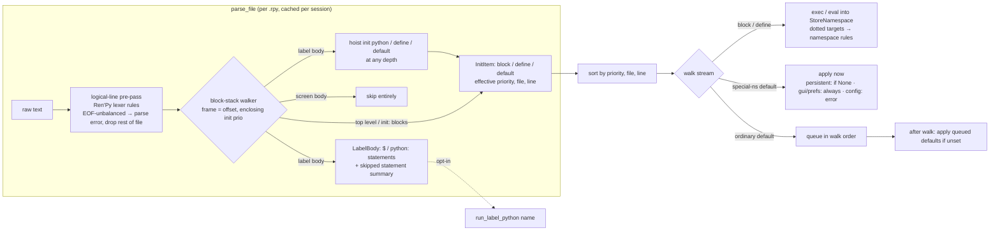

# feat: Layer 1 loads real projects

## Overview

Make Layer 1 (parse `.rpy`, exec into a mock namespace) load a real, mid-sized Ren'Py game faithfully enough to unit-test its logic against the game's *real* data. Forest's Bane is the forcing case: today `load_project()` on it yields **4 functions** and none of the core data tables, so a downstream test suite was about to fall back to hand-copied fixtures (which had already drifted — `MAX_INVENTORY_SPACE` 5 vs. the game's 6).

> **Revision note (2026-10-04, after external review):** Six correctness gaps were checked against the Ren'Py 8.3.7 SDK source and folded in. The changes: defaults now join the ordered init stream, with special-namespace defaults applied in-stream; ordinary defaults apply in stream (priority) order; init context (offset and enclosing `init N:`) is block-scoped; logical lines are computed by a file-wide pre-pass that mirrors Ren'Py's lexer, which also handles multi-line dialogue; "unset" semantics follow Ren'Py's per-namespace rules instead of `hasattr`; and an unterminated statement drops the rest of its file (Ren'Py parity) while other files load. A second internal review pass then corrected nested-init priority, defined `python:`/`$` inside `init:` blocks, specified a full special-namespace table, made ordinary defaults overwrite unless the caller pre-seeded them, and fixed block line mapping. See Key Technical Decisions and Units 1–4.

## Problem Frame

Running the current loader against `/projects/xander/forests_bane/game` (with `on_error="skip"`) shows four independent gaps:

1. **`init python:` nested in a label is skipped.** `utils.rpy` is `label init_utils:` → `    init python:` holding ~206 functions; `sounds.rpy` has the same shape. The parser treats every label body as opaque. Ren'Py hoists `init python` (and `define`/`default`) out of label bodies to init time, so this is a fidelity bug, not a scope choice.
2. **Multi-line `define`/`default` are parsed one line at a time.** `CHARACTER_DETAILS`, `PERK_DETAILS`, `WEAPONS`, `Terrain_Types`, `logs`, `STATUS_EFFECT_STYLIZATION`, `record_zoom_mode` all fail with "`{` was never closed". `item_library` is additionally an indented `default` inside `label init_item_library:` and is never seen at all. (Same limitation already logged for kid-and-king `BOOKS` in `docs/discovered-bugs.md`.)
3. **Ren'Py builtins used at init time are missing.** `config`, `gui`, `build`, `_`, `_p`, `Borders`, `Pause`, `MoveTransition`, `BarValue` raise `NameError`, taking whole init blocks down with them. Dotted targets (`define config.name = ...`, `default persistent.x = ...`) are stored under literal keys like `"config.name"` instead of being set as attributes (verified bug).
4. **Game state built in labels is unreachable.** `label init_board_dicts:` (`globals.rpy:294`) builds `Entities`, `RunStats`, `VariableItems` etc. with `$` statements — several spanning many lines. Layer 1 has no way to run them, so tests must hand-build state.

Secondary findings that shape the design:
- Fixtures always use `on_error="raise"`, so every example conftest bypasses them and calls `load_project` + `execute_into(on_error="skip")` itself. Load failures are therefore silent unless a test asserts on them — that is how "4 functions" went unnoticed.
- The loader runs *all* init blocks, then *all* defines, then defaults. Ren'Py wraps every top-level `define` and `default` in an `Init` node at `priority + init_offset` and runs them interleaved with `init` code by (priority, file, line). Special-namespace defaults (`persistent`, `gui`, `preferences`) take effect at that point in the stream. Ordinary defaults are queued in stream order and applied after init (SDK `renpy/parser.py` `define_statement`/`default_statement`; `renpy/ast.py` `Default.execute`/`execute_default`).

### Scope reversal (explicit)

`docs/plans/2026-05-06-001-feat-layer1-mock-unit-testing-plan.md` (Scope Boundaries; Open Questions → "Parser scope?") and `docs/plans/2026-05-06-002-feat-layer2-label-flow-integration-plan.md` (Problem Frame) assigned label-nested defaults, multi-line define/default, and Ren'Py builtins to Layer 2. This plan pulls them back into Layer 1 because:
- Items 1–2 are init-time semantics in Ren'Py; treating them as label runtime was a misclassification (the 05-06 plan calls MVR's label `default`s "Layer 2 territory", but Ren'Py runs them at init).
- Layer 2 needs an SDK, a subprocess, and seconds per test; unit coverage of 200+ pure functions should not pay that cost.
- Item 4 stays *opt-in* and narrow (see R6), preserving "labels are metadata by default".

## Requirements Trace

- **R1.** `init python` blocks nested anywhere inside a label body are extracted with correct dedent, priority, store name, and source line, and run in the init stream.
- **R2.** Statement boundaries follow Ren'Py's logical-line rules (open brackets, strings in any quote style including multi-line dialogue, backslash-newline, comments). `define`/`default` are recognized inside label bodies but not inside `screen` bodies, where `default` is screen-local. Text inside a continuation of a multi-line logical line is never dispatched as a statement.
- **R3.** Dotted `define`/`default` targets follow Ren'Py's namespace rules instead of literal keys. The store path is everything before the last dot, and it is matched exactly against Ren'Py's special namespaces (`renpy/common/000namespaces.rpy`), with separate define and default behavior:

  | Store path | `define` | `default` |
  |---|---|---|
  | `config` | set attribute | load error |
  | `persistent` | set if `getattr(...) is None` | set if `getattr(...) is None` (applied in-stream) |
  | `preferences`, `preferences.volume` | load error | set on the mock preferences bag (applied in-stream) |
  | `gui` (and child paths such as `gui.a.b`) | set attribute | set attribute (applied in-stream) |
  | `renpy` | load error | load error |
  | anything else (named store, incl. multi-level `a.b.c`) | set attribute on the store object | ordinary default: queued, post-init |

  For other store paths, each segment resolves in the namespace. A missing segment becomes a plain attribute-holder object. An existing object is used as-is, and if `setattr` on it fails, that is a load error naming file:line. "Unset" is never decided with `hasattr`.
- **R4.** The mock namespace provides permissive stand-ins for commonly-used init-time Ren'Py names so boilerplate files (`gui.rpy`, `options.rpy`, `screens.rpy`) execute instead of failing.
- **R5.** `init python` blocks, `define`s, and `default`s form one ordered init stream sorted by (effective priority, file key, source line), where the file key is the POSIX-style path relative to the game dir with the `.rpy` suffix removed, compared as a plain string (Ren'Py's `script.py` sort). Effective priority is resolved with block scope:
  - `define`, `default`, and plain `python:`/`$` statements directly inside an `init N:` block take that block's priority, and a `define`/`default`'s own priority is ignored (Ren'Py's `l.init` check).
  - A nested `init [N] python` or `init M:` always resolves its *own* priority (explicit or 0) plus the inherited offset, even inside another init block. Ren'Py's `init_statement` never checks `l.init`.
  - Otherwise, effective priority is the statement's own priority (explicit or 0) plus the `init offset` in effect at that point. An offset set inside a block stops applying when that block ends.

  Special-namespace defaults (R3) apply at their stream position. Ordinary defaults are evaluated after all init items, in stream order.
- **R6.** Opt-in API to run the Python statements (`$` lines and `python:` blocks, including multi-line `$`) of a named label against a test's store, skipping dialogue/display/menu statements and reporting what was skipped.
- **R7.** Load errors are visible: fixtures support a configurable error mode, expose collected errors per test, and every error (including define/default and parse-level errors) names `source_file:source_line`. Parse problems never abort `load_project`; they flow through the same error channel as runtime errors. An unterminated logical line (EOF with an open bracket or string) records one parse error. Items parsed earlier in that file are kept, the rest of that file is dropped, and other files load normally (see Key Technical Decisions → Parse recovery).
- **R8.** Plugin code stays Python 3.9-compatible (CI matrix 3.9–3.12); behavior differences from host-interpreter syntax are documented.
- **R9.** Forest's Bane acceptance:
  - Layer 1 loads the `utils.rpy` functions and the core data tables (`CHARACTER_DETAILS`, `WEAPONS`, `PERK_DETAILS`, `item_library`).
  - `run_label_python("init_board_dicts")` produces `Entities`/`RunStats`/`VariableItems`.
  - Assertions are structural (presence, non-emptiness, thresholds), so routine game content changes don't break the plugin suite.
  - Remaining load errors must match a small allowlist keyed by file and exception type (not line).
- **R10.** Existing reference projects keep working; in particular minimum-viable-rpg's `label init_utils:` / `python:` functions remain **absent** by default (`examples/minimum-viable-rpg/test_rpg.py::TestLayerBoundary`). This boundary is a mock choice, not engine behavior: MVR's `script.rpy` has `init:` / `call init_utils`, so the real engine *does* run that label's `python:` at init (see Scope Boundaries).

## Scope Boundaries

- No execution of Ren'Py-script control flow inside labels (`if`/`while`/`menu`/`call`/`jump` statements as Ren'Py statements). R6 runs only Python statements at the label's top level.
- No `python early`, creator-defined statements, `transform`/`image`/`style` semantics, or screen language.
- No following of `call` statements inside `init:` blocks. In Ren'Py, `init: call X` runs label `X` at init, so its plain `python:` code is init-time. The mock leaves such labels unexecuted. This is a deliberate, documented divergence that keeps R10's layer boundary, and tests can opt in with `run_label_python(X)`.
- No per-store namespaces for `init python in X` — still one shared namespace (store name stays recorded). Documented, not fixed.
- No attempt to emulate Ren'Py's bundled interpreter version; game code compiles on the host Python.
- No emulation of Ren'Py's rollback/`ever_been_changed` tracking or `repeat_at_default_time` re-application. The mock always loads as a fresh game start.
- No changes to Layer 2.

### Deferred to Separate Tasks

- Forest's Bane's own test suite (dttt-driven) — in the `forests_bane` repo, after this lands.
- Splitting oversized init blocks so one bad statement does not drop the whole block — follow-up if R9's allowlist shows it is needed.
- README troubleshooting text that still calls `--renpy-sdk` required (belongs with the packaging PR's follow-ups).

## Context & Research

### Relevant Code and Patterns

- `src/pytest_renpy/rpy_parser.py` — line-by-line state machine (`TOPLEVEL`, `IN_INIT_PYTHON`, `IN_LABEL`, `IN_SCREEN`, `IN_RENPY_BLOCK`); regexes matched against stripped lines; label/screen bodies skipped via `skip_indent`. Note: indented `define`/`default`/`init python:` inside non-label blocks (`init:`, `transform`) are *already* dispatched — the gap is specifically the label skip.
- `src/pytest_renpy/loader.py` — `ProjectData.execute_into()`; injected names list; error wrapping (`SyntaxError` rewrap with shifted lineno, `RuntimeError("Error executing init block from file:line")`). Ordinary defaults currently apply only when `name not in namespace`.
- `src/pytest_renpy/mock_renpy/` — `MockRenpy.__getattr__` → `_NoOpStub` (records calls, child stubs on attribute access); `config.py` `MockConfig` attribute bag; `display.py` home for display stubs; `persistent.py` `MockPersistent` (dict-backed; missing attributes read as `None`, matching Ren'Py); `store.py` `StoreNamespace(dict)`.
- `src/pytest_renpy/fixtures.py` — `renpy_project` (session, parse once), `renpy_store`/`renpy_mock`/`renpy_game` (function scope, re-exec per test).
- Tests: `tests/test_rpy_parser.py` (inline `tmp_path` `.rpy` content, module-level tests under `# --- Happy path / Edge case` banners, `compile(block.code, ...)` assertions), `tests/test_loader.py` (classes, `write_rpy` helper, `pytest.raises(RuntimeError, match="file.rpy")`), `tests/test_fixtures.py` (`pytester`).
- Examples: `examples/minimum-viable-rpg/{conftest.py,test_rpg.py}` is the Layer 1 example pattern to mirror; `examples/forests-bane/` has only the Layer 2 `test_bekri_flow.py`.

### Ren'Py SDK behavior relied on (verified in 8.3.7 source)

- **Logical lines** (`renpy/lexer.py` `list_logical_lines`): a newline ends a logical line only when bracket depth is 0. `"`, `'` and `` ` `` strings, single or triple, are consumed whole and may span newlines; brackets inside strings don't count. Backslash escapes and backslash-newline continue the line. `#` comments are consumed. Lines that are blank or comment-only are dropped. The scan runs over the whole file before any statement parsing.
- **Priority** (`renpy/parser.py`): `define [N]`, `default [N]` and `init [N]` all wrap in `Init(priority + l.init_offset)` when not already inside an init context. Inside `init N:` (`l.init` true) a nested `define`/`default` is not re-wrapped, so its own priority is ignored and it runs at the block's priority.
- **Offset scope** (`renpy/lexer.py` `subblock_lexer`): each block gets a fresh lexer that *inherits* the parent's `init_offset`. `init offset = N` mutates only the current lexer, so an offset set inside a label body or `init:` block ends with that block. At file top level it applies to the rest of the file.
- **Defaults** (`renpy/ast.py` `Default.execute`): at init time, special-namespace defaults call `ns.set_default` right away. Other defaults are appended to `default_statements` and evaluated after init in that order (`execute_default`).
- **Special namespaces** (`renpy/common/000namespaces.rpy`): `store.config` (`default` raises), `store.persistent` (set-if-`None` for both define and default), `store.preferences` (sets the preference), `store.gui` (unconditional `setattr`), `store.renpy` (both raise).

### Institutional Learnings

- Keep 2-argument `exec(code, namespace)`, one shared namespace, re-exec per test, never deep-copy (functions' `__globals__`) — 05-06-001 Key Decisions.
- Every executable unit must carry `source_file:source_line` for errors — 05-06-001.
- Whole-block failure from host-syntax differences (terminalgame duplicate `global` under 3.12) — `docs/discovered-bugs.md`.
- Forest's Bane: no `start` label (uses `start_run` / `start_debug_run`); `attribute_check` reads `CHARACTER_DETAILS` + `permanent_attribute_modifier`; label bodies mix `$` state with `$ NA("...")` dialogue calls — `docs/discovered-bugs.md`, `examples/forests-bane/test_bekri_flow.py`.

### External References

- Ren'Py lifecycle — init phase ordering and `init offset` block scoping: https://www.renpy.org/doc/html/lifecycle.html#init-phase, https://www.renpy.org/doc/html/lifecycle.html#init-offset-statement
- Ren'Py logical lines (multi-line strings and brackets): https://www.renpy.org/doc/html/language_basics.html#logical-lines
- Ren'Py "Python Statements" / "Defining Variables" for `define`/`default` semantics.

## Key Technical Decisions

- **Hoist only init-time statements from labels** (`init python`, `define`, `default`); plain label `python:` and `$` stay runtime. Rationale: these are the statements Ren'Py itself treats as init-time wherever they appear, and keeping it narrow preserves MVR's layer-boundary test (R10). The `init: call` divergence is listed in Scope Boundaries.
- **File-wide logical-line pre-pass mirroring Ren'Py's lexer.** Before the state machine runs, split each file into logical lines using Ren'Py's rules (brackets; `"`/`'`/`` ` `` strings, single or triple, spanning newlines; escapes; backslash-newline; comments). Each logical line keeps its start line, end line, and the original physical text. The state machine then dispatches on logical lines only. This replaces the earlier per-statement `tokenize` joiner. Rationale:
  - Python's `tokenize` rejects multi-line `"…"` dialogue strings, which Ren'Py accepts.
  - A per-statement joiner can't stop hoist patterns from matching inside a dialogue continuation (`e "…` / `default score = 99` / `…"`).
  - Splitting the way Ren'Py does means any file Ren'Py accepts splits identically.
  - Comment-only lines drop out naturally, which gives the "comments never end a block" rule that Forest's Bane `utils.rpy` needs.
  - Bracketed continuation lines indented less than an `init python` body no longer end the block early.

  `init python` and `python:` block code is the *contiguous physical range* from the first body line through the last body logical line's end. That range includes the blank and comment-only lines the pre-pass dropped, so `source_line + lineno - 1` traceback mapping stays exact. When dedenting, only the first physical line of each logical line loses the block indent. Continuation lines inside brackets or strings stay verbatim, as in Ren'Py's `python_block`, so triple-quoted string values aren't altered.
- **Parse recovery: drop the rest of the file.** If the pre-pass reaches EOF with an open bracket or string, it records one parse error at the logical line's start (file, line, what was left open). It keeps the items already parsed from that file, discards everything from the bad line onward, and lets other files load normally.

  Rationale: rescanning from the next line was considered and rejected. An unclosed quote flips string/code pairing for the rest of the file, so a rescan can silently swallow real statements or invent spurious ones, with no further error. Ren'Py rejects the whole file. Keeping the earlier items is a small, honest concession that keeps `skip`-mode loads useful, and the parse error still surfaces in `load_errors` and fails `raise` mode. An imbalance that a later unrelated closer happens to "fix" mis-joins silently, exactly as in Ren'Py. The joined statement then fails to compile and reports its start line.
- **Unified init stream, defaults included.** The parser emits one ordered list of init items: init blocks, defines, and defaults. Each carries effective priority, relative path, and line. The loader sorts once and walks it:
  - Blocks and defines execute when reached.
  - Special-namespace defaults (`persistent`, `gui`, `preferences`, `preferences.volume`; `config` and `renpy` are errors) apply when reached, per the R3 table.
  - Ordinary defaults are queued in walk order, then evaluated after the walk.

  Rationale: R5, and it matches Ren'Py's `Default.execute`/`execute_default` split exactly. `default persistent.seen = {}` followed by an `init python` that uses `persistent.seen` works. A default that reads an earlier-priority default from another file works. Forest's Bane `gui.rpy` (`init offset = -2`) and `screens.rpy` (`-1`) run before priority-0 game code.
- **Block-scoped init context.** The parser keeps a stack of init context frames, pushing one when a block opens and popping it at dedent. Each frame holds the current `init offset` and the enclosing init priority, if inside `init N:`. `init offset = N` updates only the top frame. A new frame inherits the parent's offset. Effective priority resolution:
  - `define`/`default`/plain `python:`/`$` inside an enclosing init: that init's priority;
  - nested `init [N] python` / `init M:`: always its own priority (or 0) plus the frame's offset, never the enclosing init's;
  - everything else: the statement's own priority (explicit or 0) plus the frame's offset.

  Plain `python:` blocks and `$` lines directly inside an `init [N]:` block (outside any label) become init-block items at the enclosing priority. MVR's `init:` / `$ config.rollback_enabled = False` is this shape. The init-python pattern also accepts `hide` (`init python hide:`) and dotted store names (`in a.b`).

  Explicit priorities on `default N` are now parsed: `_RE_DEFINE` and `Define.priority` already handle `define N`, but `_RE_DEFAULT` and `Default` need a priority group and field. Rationale: mirrors `subblock_lexer` inheritance and `l.init` suppression.
- **"Unset" follows Ren'Py's per-namespace rules, never `hasattr`.**
  - `persistent`: `getattr(persistent, name) is None`. `MockPersistent` already returns `None` for missing names, and Ren'Py uses the same test.
  - `gui`, `preferences`, `preferences.volume`: unconditional set, so permissive bags that return stubs for unknown reads never need a presence check.
  - `config`, `renpy`: `default` reports an error.
  - Ordinary defaults (undotted names and named-store paths) assign unconditionally, as Ren'Py does at game start (`execute_default(start=True)`). The only exception is a target the *caller* pre-seeded. `execute_into` snapshots the namespace keys, and the stored values of any store objects passed in, before injecting builtins or running init. A default whose target is in that snapshot is skipped. Init code, defines, and injected builtins never block a default.

  Rationale: `hasattr` on a permissive bag is always true and would silently skip defaults. Today's `name not in namespace` rule would likewise let init code or the new stand-ins (`build`, `style`, `_`, …) silently swallow a game's `default`.
- **Permissive builtins as explicit objects, not a catch-all namespace.** Add named stand-ins:
  - `config`: the existing `MockConfig` (unknown reads stay `None`), extended with list-typed defaults for the config lists that stock boilerplate mutates (`overlay_screens`, `character_id_prefixes`, `underlay`, `layers`, and others found while loading reference projects). Stock `screens.rpy` calls `config.overlay_screens.append(...)`, which `None` would break.
  - `gui`/`build`/`preferences`/`style`: attribute bags that accept arbitrary writes and stub method calls.
  - `_`/`_p`/`__`: identity/dedent functions.
  - `Borders`/`Pause`/`MoveTransition`/`BarValue`/etc.: recording display stubs.

  Rationale: a `__missing__`-style namespace would turn genuine game `NameError`s into silent stubs — exactly the class of bug we want tests to catch.
- **Error mode configurable, default unchanged.** Add an ini/CLI option, `renpy_on_error = raise|skip`, defaulting to `raise` for backward compatibility.
  - `execute_into` keeps returning `(item, exc)` 2-tuples, so existing example conftests that unpack `for b, e in errors` keep working. `item` now always carries `source_file`/`source_line`, including for defines, defaults, and parse errors.
  - Per-test errors reach tests through a function-scoped fixture that `renpy_game.load_errors` reads. Nothing per-test is stored on the session-scoped `ProjectData`.
  - Parse errors are recorded on `ParsedFile`/`ProjectData` (immutable, session-safe) and replayed into each `execute_into` error list.

  Rationale: R7 without breaking existing users; real projects will use `skip` plus an allowlist assertion.
- **Label Python API lives on the game object and as a loader function.** `renpy_game.run_label_python(name)`, with an underlying function usable on a raw namespace, runs statements in source order and returns a result listing executed and skipped statements. Python control-flow exceptions (`JumpException`, etc.) propagate. Rationale: matches existing `renpy_game` ergonomics; the result object makes skipping auditable.

## Open Questions

### Resolved During Planning

- *Base branch?* `main`. PR #1 (packaging/CI) has merged, so the CI matrix is available.
- *Include label-state execution?* Yes, opt-in API (user decision).
- *Does damage.rpy need Python 3.12?* Partly: `game/damage.rpy:115` nests same-type quotes in an f-string (3.12+ only). Ren'Py 8.3.7 bundles Python 3.9, so that block would not compile in the real engine either — a game bug or a sign the game targets Ren'Py 8.4+. Record in `docs/discovered-bugs.md`; not a plugin issue. (The logical-line pre-pass splits that line correctly either way: the nested quotes pair up as two adjacent strings.)
- *File ordering key?* The POSIX-style path relative to the game dir with `.rpy` stripped, compared as a string. This matches Ren'Py (`script.py` `scan_script_files`/`load_script`). It is not the absolute path, which can reorder across checkouts, and the extension is not kept, because keeping it would sort `gui-old.rpy` before `gui.rpy`.
- *Do defaults wait until after init?* Only ordinary ones. Special-namespace defaults apply at their stream position (SDK `Default.execute`).
- *How are ordinary defaults ordered among themselves?* By init-stream order, meaning effective priority, then file, then line (SDK `default_statements` append order).
- *Is `init offset` per file?* Per block, inherited by nested blocks (SDK `subblock_lexer`). At file top level it is effectively per file.
- *Joiner: Python `tokenize` or a custom scanner?* A custom scanner that mirrors `list_logical_lines`, run over the whole file. `tokenize` rejects valid Ren'Py dialogue.
- *Same-file parse recovery?* No rescan. Keep earlier items from the file, drop the rest, and record one parse error (see Key Technical Decisions). Rescanning was rejected because quote-pairing flips make it silently lossy.
- *Does a nested `init python` inside `init N:` take N?* No. Only `define`/`default` and plain `python:`/`$` take the enclosing priority (SDK `init_statement` vs `define_statement`).
- *Should undotted defaults keep skip-if-present?* No. Skip only caller-pre-seeded targets (snapshot) and otherwise overwrite as Ren'Py does at start.

### Deferred to Implementation

- Exact API names (`run_label_python`, result type fields, ini key spelling, init-item type names) — settle while writing tests.
- Final list of builtin stand-ins — start from the Forest's Bane/terminalgame/kid-and-king error lists; add only names that real projects reference at init time.
- Whether `logs.rpy:41` (`define slide_in_logs = MoveTransition(..., enter=slide_down)` referencing a label-local `transform`) resolves via a `transform`-name stub or lands on the allowlist.
- Whether hoisting MVR's 19 label `default`s changes any MVR example assertions (research found only the function-absence test).
- `run_label_python` boundaries: stop at the label's end (proposed) vs. fall through to the next label like Ren'Py; behavior for duplicate label names across files (proposed: raise listing both locations); whether skipping a Ren'Py control-flow block warns by default.
- Whether the existing `IN_*` states survive the move to logical lines or collapse into a single block-stack walker — decide once characterization tests are in place.

## High-Level Technical Design

> *This illustrates the intended approach and is directional guidance for review, not implementation specification. The implementing agent should treat it as context, not code to reproduce.*

## Implementation Units

- [x] **Unit 1: Logical-line pre-pass, recovery, and multi-line define/default**

**Goal:** Split every file into Ren'Py logical lines before dispatch; capture multi-line `define`/`default`; carry source location on `Define`/`Default`; recover from unterminated statements under a defined policy.

**Requirements:** R2 (logical-line half), R7 (location, recovery)

**Dependencies:** None

**Files:**
- Modify: `src/pytest_renpy/rpy_parser.py`
- Test: `tests/test_rpy_parser.py`

**Approach:**
- Add a pre-pass that yields logical lines (start line, end line, indent of first physical line, joined text for statement matching, original physical text for code reconstruction). Rules follow `list_logical_lines`:
  - bracket depth, with brackets inside strings ignored;
  - `"`, `'` and `` ` `` strings, single and triple, with backslash escapes;
  - backslash-newline continues the line;
  - `#` comments are stripped from the matching text;
  - blank and comment-only logical lines are dropped;
  - a leading U+FEFF BOM is skipped (Ren'Py-generated `gui.rpy`/`screens.rpy`/`options.rpy` carry one).
- The existing state machine is driven by logical lines rather than physical lines. `init python`/`python:` bodies take the contiguous physical range of the block, including dropped blank/comment lines. Only the first physical line of each logical line is dedented, so line numbers and string contents are preserved (see Key Technical Decisions).
- Recovery: at EOF with open bracket or string, record a parse error (file, start line, unclosed delimiter), keep the logical lines already emitted for that file, and stop processing that file.
- `Define`/`Default` gain `source_file`/`source_line`; parse problems are collected on `ParsedFile` (file, line, message) rather than raised.

**Execution note:** Add characterization tests for current top-level parsing first, including all existing `tests/test_rpy_parser.py` cases and an `init python` block with internal comments and blank lines, then switch to logical lines.

**Patterns to follow:** inline `tmp_path` parser tests with `compile(...)`/`eval` assertions.

**Test scenarios:**
- Happy path: kid-and-king-style `default BOOKS = {` … `}` over 6 lines → one Default whose expression evals to the 4-key dict.
- Happy path: multi-line `define WEAPONS = {` with nested dicts and trailing commas → evals correctly.
- Happy path: triple-quoted string spanning lines (`define gui.about = _p("""` … `""")`) → one Define.
- Edge case: brackets inside string literals (`"{"`, `'('`) don't affect balance; closing bracket on the same line as content.
- Edge case: continuation line beginning with `label`/`define` text inside a bracketed literal is not treated as a statement.
- Edge case: comment lines (including ones containing `{` or `"`) and blank lines inside a literal don't break balance.
- Edge case: top-level multi-line dialogue `e "first line` / `default score = 99` / `last line"` → one logical line, **no** Default produced.
- Edge case: single-quoted string spanning lines and backslash-newline continuation each join into one logical line with the correct start line.
- Edge case: `init python:` body with a bracketed continuation line indented *less* than the body → block does not end early; code compiles.
- Edge case: Python f-string with nested same-type quotes (`f"{d["k"]}"`) → splits as one logical line (no false imbalance).
- Error path (recovery): `define BEFORE = 0`, then `define BROKEN = {` never closed, then `define AFTER = 1` → parse error names the file and BROKEN's line; `BEFORE` is parsed; `AFTER` is not; `parse_file` does not raise.
- Error path (cross-file): a file with an unterminated literal plus a second well-formed file → the second file's items load fully.
- Edge case (line mapping): `init python:` body with a comment-only line and a blank line between two `def`s, the second raising at call time → traceback line maps to the correct `.rpy` line.
- Edge case (dedent): triple-quoted string inside an `init python` body whose continuation lines are indented → string value identical to the source text (continuation lines not dedented).
- Edge case: file beginning with a UTF-8 BOM followed directly by `init offset = -2` → offset recognized.
- Error path: unterminated `"` at EOF in the last statement → parse error with start line; earlier items intact.
- Regression: existing single-line define/default and init-block tests unchanged; `source_line` values unchanged for single-line statements.

**Verification:** All existing parser tests pass; new tests cover the kid-and-king `BOOKS` shape, multi-line dialogue, and recovery.

- [x] **Unit 2: Hoist init-time statements out of label bodies, with block-scoped init context**

**Goal:** Inside label bodies, extract `init python` blocks and `define`/`default` statements at any depth; keep skipping everything else; keep screens fully opaque; resolve effective priority with a block stack.

**Requirements:** R1, R2 (label half), R5 (priority resolution), R10

**Dependencies:** Unit 1

**Files:**
- Modify: `src/pytest_renpy/rpy_parser.py`
- Test: `tests/test_rpy_parser.py`

**Approach:**
- Replace the opaque label skip with a scan over the label's logical lines:
  - `init [N] python [in X]:` starts an init-block collection, dedented by the block's own body indent. When the block ends, label scanning resumes rather than returning to TOPLEVEL.
  - `define`/`default` logical lines are recorded.
  - Every other logical line is consumed whole, including multi-line dialogue, `$` statements, and `python:` bodies, so hoist patterns never match inside them.
- Plain `python:` / `$` inside labels are *not* hoisted. They are recorded for Unit 5.
- Comment-only lines never end a block. This comes free with Unit 1, and a Forest's Bane-shaped test pins it.
- Maintain an init-context stack, one frame per open block. Each frame holds `offset` (inherited from its parent) and `enclosing_init_priority` (set by `init N:` blocks, inherited by nested blocks).
  - `init offset = N` updates only the top frame.
  - Popping at dedent restores the parent's offset.
  - Effective priority = `enclosing_init_priority` if set, else (explicit `N` or 0) + `offset`.
- Applies to init blocks, defines, and defaults in all contexts (top level, `init:` blocks, labels). `_RE_DEFAULT` learns the optional priority integer (`_RE_DEFINE` already has it).
- Plain `python:` blocks and `$` lines directly inside a top-level `init [N]:` block become init-block items at the enclosing priority. The init-python pattern accepts `hide` and dotted `in a.b` store names.
- Screen bodies remain skipped wholesale (screen `default` is screen-local).

**Execution note:** Add characterization tests for current label/screen skipping before changing the state machine.

**Test scenarios:**
- Happy path: `label init_utils:` / `    init python:` / `        def f(): ...` → one InitBlock, dedented code compiles, `source_line` points at the `init python:` line.
- Happy path: `init -5 python in mystore:` inside a label → priority -5, store name recorded.
- Happy path: `label x:` / `    default item_library = {` (multi-line) → Default extracted.
- Happy path: `default 5 late = 1` and `define -3 early = 0` → priorities 5 and -3 recorded.
- Edge case: label containing `init python:` followed by more label statements at the label's indent → block ends correctly; later label-level `define` still captured.
- Edge case: two `init python:` blocks in one label, and a label immediately after another label.
- Edge case (Forest's Bane shape): label → `init python:` body at indent 8 containing a comment at indent 4 followed by more `def`s → one InitBlock containing all functions.
- Edge case: top-level `init offset = -2` then `define gui.x = 1` and `init python:` → both priority -2; a later top-level `init offset = 0` resets subsequent items.
- Edge case (block scope): `label a:` / `    init offset = 5` / `    define in_label = 1`, then top-level `define after = 1` → `in_label` priority 5, `after` priority 0 (offset restored after dedent).
- Edge case (inheritance): top-level `init offset = -2`, then a label containing `define x = 1` → `x` priority -2.
- Edge case (enclosing init): `init -10:` / `    define d = 1` / `    define 5 e = 2` / `    default f = 3` → all three priority -10 (own priority ignored); with a top-level `init offset = 3` above, `init -10:` resolves to -7 and its children follow.
- Edge case (nested init keeps own priority): `init -10:` / `    init python:` / `        X = 1` → InitBlock at priority 0 (or 0 + offset), not -10; `init -10:` / `    init 5 python:` → priority 5.
- Happy path (MVR shape): `init:` / `    $ config.rollback_enabled = False` → one init item at priority 0; `init -1:` / `    python:` / `        X = 1` → InitBlock at priority -1.
- Happy path: `init python hide:` and `init python in a.b:` inside a label → extracted (store name `a.b` recorded).
- Edge case: multi-line dialogue inside a label whose continuation line reads `default score = 99` → no Default produced.
- Edge case: `define x = 1` text inside a triple-quoted string in a label `python:` block → not hoisted.
- Edge case: `default` inside a `screen` → not extracted (both top-level screen and screen following a label).
- Boundary (R10): `label init_utils:` / `    python:` / `        def g(): ...` → **no** InitBlock produced.
- Regression: label names/lines still collected as metadata.

**Verification:** Parsing Forest's Bane `utils.rpy` yields an InitBlock whose code compiles on 3.12 and defines the expected function names (spot-check a handful).

- [x] **Unit 3: Unified init stream with defaults, namespace-aware targets**

**Goal:** Execute init blocks, defines, and defaults as one stream ordered by (priority, file, line). Apply special-namespace defaults in-stream, apply ordinary defaults after init in stream order, apply dotted targets by Ren'Py's namespace rules, and attach locations to define/default errors.

**Requirements:** R3, R5, R7

**Dependencies:** Unit 1 (locations), Unit 2 (priorities, more items in stream)

**Files:**
- Modify: `src/pytest_renpy/loader.py`
- Test: `tests/test_loader.py`

**Approach:**
- `ProjectData` holds one init-item sequence sorted by (effective priority, path relative to game dir, line), and `execute_into` walks it. `init_blocks`/`defines`/`defaults` remain available as filtered views for existing callers.
- Default handling at its stream position:
  - Store path `persistent`, `gui` (or a `gui.*` child), `preferences`, or `preferences.volume`: apply immediately using the R3 table.
  - Store path `config` or `renpy`: record an error naming file:line, as in Ren'Py.
  - Anything else: append to a pending list. After the walk, evaluate pending defaults in list order, skipping only targets in the caller's pre-seed snapshot.
- Defines dispatch through the same R3 table (`define persistent.x` set-if-None, `define preferences.x`/`define renpy.x` → error).
- `execute_into` snapshots caller-provided namespace keys (and stored values of caller-provided store objects/persistent) before injecting builtins.
- Dotted target `a.b = expr`:
  - Special namespaces dispatch per R3.
  - Any other store path resolves segment by segment: a missing segment becomes a plain attribute holder, and an existing object is used as-is (a failing `setattr` is a load error with file:line). Never `hasattr`/`getattr` for presence.
- `execute_into` gains an optional `persistent=` argument (or reuses an existing `namespace["persistent"]`) so tests can pre-populate persistent data before defaults apply.
- Error messages for define/default include `file:line`.

**Test scenarios:**
- Happy path: `init python:` at priority 0 in file A reads a `define` that appears earlier in the same file → succeeds (fails today).
- Happy path: `define 5 X = 1` runs after a priority-0 init block that would otherwise read `X` → NameError reproduced as in Ren'Py (ordering honored both ways).
- Happy path: `zz_gui.rpy` with `init offset = -2` + `define G = 1`, and `aa_game.rpy` with priority-0 `init python: y = G` → loads cleanly (offset beats filename order).
- Happy path (persistent in-stream): `default persistent.seen = {}` then, later in the same file, `init python: persistent.seen["intro"] = True` → loads cleanly; `persistent.seen == {"intro": True}`.
- Happy path (special default inside a label): label-nested `default persistent.flags = set()` at priority 0 is visible to a priority-0 init block in a later file.
- Happy path (ordinary default ordering): `zz.rpy` has `default -1 base = 10`; `aa.rpy` has `default derived = base * 2` → `derived == 20` because `base`'s priority sorts it first despite file order. Companion: both at priority 0, `aa.rpy` `default first = 1` and `zz.rpy` `default second = first + 1` → file order decides.
- Happy path (offset applies to defaults): `zz.rpy` with `init offset = -5` + `default early = 1`, `aa.rpy` with `default late = early + 1` → `late == 2`.
- Edge case: ordinary defaults evaluate after *all* init items — `default d = LATE` where `LATE` is defined by a priority-999 init block → succeeds.
- Edge case: files in subdirectories order by relative path regardless of where the project is checked out; at equal priority `a.rpy` runs before `a-b.rpy` (extension-stripped key).
- Happy path: `define config.name = "Game"` → `ns["config"].name == "Game"`, no `"config.name"` key.
- Happy path: `default persistent.seen = 1` on a fresh persistent → `ns["persistent"].seen == 1`.
- Edge case: `execute_into(..., persistent=p)` where `p.seen = 5` already → default does not overwrite (stays 5).
- Edge case (named store): `default mystore.score = 0` where `mystore` is absent → holder created, `mystore.score == 0`; when the caller passes a namespace whose `mystore.score` is 3 → stays 3; when an *init block* set `mystore.score = 3` → default overwrites to 0.
- Edge case (multi-level): `define a.b.c = 1` with nothing pre-existing → `a.b.c == 1`; `define gamedata.x = 1` where `gamedata` is an existing dict → load error with file:line.
- Edge case (overwrite like Ren'Py): `init python: x = 1` plus `default x = 2` → `x == 2`; `default build = []` → `build == []`, not the injected stub.
- Error path: `define preferences.text_cps = 1`, `define renpy.foo = 1`, `default renpy.foo = 1` → each a load error naming file:line.
- Happy path: `define persistent.flag = 1` on fresh persistent → 1; with persistent pre-set to 5 → stays 5.
- Error path: `default config.x = 1` → error naming file:line (raise mode raises; skip mode records and continues).
- Error path: failing define and failing default each report `source_file:source_line`, under both `raise` and `skip`.
- Regression: two-argument exec semantics — `globals()[name]` dispatch still works (terminalgame pattern); an undotted default is still skipped when the *caller* pre-seeded the name in the namespace passed to `execute_into`.

**Verification:** Existing loader tests pass; new ordering and default tests pass.

- [x] **Unit 4: Permissive Ren'Py builtins**

**Goal:** Boilerplate init code executes instead of failing.

**Requirements:** R3 (gui/preferences targets), R4

**Dependencies:** Unit 3 (dotted targets write into these objects)

**Files:**
- Modify: `src/pytest_renpy/mock_renpy/__init__.py`, `src/pytest_renpy/mock_renpy/config.py`, `src/pytest_renpy/mock_renpy/display.py`, `src/pytest_renpy/loader.py`
- Test: `tests/test_mock_renpy.py`, `tests/test_loader.py`

**Approach:**
- `config` (the same object as `renpy.config`) stays a `MockConfig` whose unknown reads return `None`, plus list-typed defaults for commonly mutated config lists (`overlay_screens`, `character_id_prefixes`, `underlay`, `layers`, …), fresh per `execute_into`.
- Inject `gui`, `build`, `preferences`, `style` as permissive bags: arbitrary attribute writes stick; unknown reads return a recording stub; method calls (`build.classify(...)`, `gui.init(...)`) are recorded no-ops.
- Bags keep written values in an explicit store, separate from stub generation, so tests and the loader can tell "written" from "stub returned" without `hasattr`. Defaults into `gui`/`preferences` are unconditional (R3), so the loader never needs a presence check on these bags.
- `_`, `__`, `_p` as text passthroughs (`_p` dedents/joins like Ren'Py's paragraph helper closely enough for equality on simple input).
- Display stand-ins in `display.py` (`Borders`, `Pause`, `MoveTransition`, `BarValue`, plus whatever Unit 6's error list shows is common), recording constructor args, following the existing `Transform`/`Dissolve` pattern.
- Don't add a catch-all for unknown names.

**Test scenarios:**
- Happy path: a stock Ren'Py `gui.rpy`-shaped snippet (`init offset = -2`, `init python: gui.init(1920, 1080)`, `define gui.text_size = 33`, `define gui.button_borders = Borders(6, 6, 6, 6)`) loads with zero errors.
- Happy path: `define config.name = _("Forest's Bane")` → `config.name == "Forest's Bane"`.
- Happy path: `build.classify("**~", None)` inside init python → no error, call recorded.
- Happy path: stock `screens.rpy` lines `config.character_id_prefixes.append('namebox')` and `config.overlay_screens.append("quick_menu")` inside init python → no error, lists contain the values; a second test sees fresh empty lists.
- Edge case: unknown `config.some_unset_option` still reads as `None` (existing behavior preserved).
- Edge case (untouched permissive bag): `default gui.accent = "#f00"` on a fresh `gui` → `gui.accent == "#f00"` (a real value, not a stub); `default preferences.text_cps = 40` likewise.
- Edge case: a never-written `gui.unknown_thing` read returns a stub but is not reported as a written value.
- Edge case: `config` and `renpy.config` are the same object; per-test isolation preserved (fresh objects per `execute_into`).
- Error path: an unrelated undefined name (`totally_undefined()`) still raises `NameError` (wrapped with file:line).

**Verification:** Loading the stock-boilerplate snippet produces no errors.

- [x] **Unit 5: Opt-in label Python execution**

**Goal:** Run a label's top-level `$` and `python:` statements against a store to build real game state.

**Requirements:** R6

**Dependencies:** Unit 1 (logical lines for multi-line `$` and dialogue), Unit 2 (label body scanning records statements)

**Files:**
- Modify: `src/pytest_renpy/rpy_parser.py` (record label body statements), `src/pytest_renpy/loader.py` (runner function), `src/pytest_renpy/fixtures.py` (`RenpyGame` method)
- Test: `tests/test_rpy_parser.py`, `tests/test_loader.py`, `tests/test_fixtures.py`

**Approach:**
- The parser records, per label, an ordered list of top-level body statements:
  - Python statements: `$ expr` taken from its full logical line, and `python:` blocks dedented. Each has its source line.
  - Non-Python logical lines: skip entries (kind + line). A multi-line dialogue line is one entry.
  - Nested Ren'Py blocks (`if:`/`menu:`): one skipped entry each.
- The runner execs Python statements in order with two-arg exec into the given namespace and returns a result with executed/skipped entries. Exceptions are wrapped with `file:line`, keeping the original. `JumpException`/`CallException`/`ReturnException` propagate unwrapped so tests can assert on them.
- `return` at label end is a no-op; unknown label → clear error listing near matches.

**Test scenarios:**
- Happy path: label with `$ a = 1`, `$ b = {` multi-line `}`, `python:` block appending to `b` → namespace has `a`, `b` with appended item.
- Happy path: label containing dialogue (`e "Hello"`), `show`, `scene`, `with dissolve` → those appear in `skipped`, Python statements still run in order.
- Happy path: `$ NA("text")` where `NA` is a `Character` → executes without error (Character mock callable).
- Edge case: multi-line dialogue whose continuation starts with `$ x = 1` → one skipped entry; `x` never assigned.
- Edge case: `if cond:` Ren'Py block inside label → recorded as skipped (with line), its body not executed.
- Edge case: `$ renpy.jump("x")` → `JumpException` propagates with target `"x"`.
- Error path: statement raising `KeyError` → error names the `.rpy` file and line.
- Error path: unknown label name → error, not silent no-op.
- Integration (pytester): `renpy_game.run_label_python("init_state")` in a generated project populates `renpy_game.store`.

**Verification:** New tests pass; default fixture behavior (no call) unchanged — labels still metadata unless invoked.

- [x] **Unit 6: Error visibility in fixtures**

**Goal:** Real projects can load with `skip` via configuration and assert on what failed.

**Requirements:** R7

**Dependencies:** Unit 3

**Files:**
- Modify: `src/pytest_renpy/plugin.py`, `src/pytest_renpy/fixtures.py`, `src/pytest_renpy/loader.py`
- Test: `tests/test_fixtures.py`, `tests/test_plugin.py`

**Approach:**
- Add `--renpy-on-error` / `renpy_on_error` ini (default `raise`). The function-scoped store fixture uses it and hands its `(item, exc)` list to a function-scoped `renpy_load_errors` fixture; `RenpyGame.load_errors` reads that per-test list. No per-test state on `ProjectData`.

**Test scenarios:**
- Happy path: project with one broken init block, ini `renpy_on_error = skip` → test sees store populated from other blocks and `load_errors` has one entry naming the file.
- Happy path: default config still raises on the broken block (backward compatibility).
- Edge case: CLI flag overrides ini.
- Edge case: a project with a parse error (`a.rpy` has an unterminated `define X = {`; `b.rpy` has `define Y = 1`) under `skip` → `Y` is in the store, other tests still run, and `load_errors` contains the parse error with file:line; under `raise` → the store fixture raises it.
- Edge case: `default config.x = 1` under `skip` appears in `load_errors` with file:line.
- Regression: example-conftest style `for b, e in project.execute_into(ns, on_error="skip")` with `b.source_file` still works, including for define and default errors.

**Verification:** pytester tests pass on 3.9–3.12 CI.

- [x] **Unit 7: Forest's Bane Layer 1 acceptance example and docs**

**Goal:** Prove R9 on the real game and document the new behavior.

**Requirements:** R8, R9, R10

**Dependencies:** Units 1–6

**Files:**
- Create: `examples/forests-bane/conftest.py`, `examples/forests-bane/test_layer1_loading.py`
- Modify:
  - `README.md`: What gets parsed / What's mocked / Layer 2 intro, plus init ordering and default semantics.
  - `docs/discovered-bugs.md`: Forest's Bane `damage.rpy:115` f-string; update the kid-and-king multi-line and MVR notes.
  - `docs/plans/2026-05-06-001-feat-layer1-mock-unit-testing-plan.md`: one-line note pointing to this plan's scope reversal.
- Test: `examples/forests-bane/test_layer1_loading.py`, existing `examples/minimum-viable-rpg/test_rpg.py`, `examples/kid-and-king/`, `examples/terminalgame/`

**Approach:**
- Conftest mirrors `examples/minimum-viable-rpg/conftest.py` (env-overridable game dir, skip if absent, `skip` error mode).
- Tests assert presence/shape of real data rather than values or game logic (value and logic tests belong in the Forest's Bane repo, which changes daily).

**Test scenarios:**
- Integration: the store holds more than a threshold number of functions from `utils.rpy` (e.g. ≥150), and a handful of long-lived `utils.rpy` helpers are callable. Spot-checks come only from `utils.rpy`, never `damage.rpy` (which can't compile below Python 3.12).
- Integration: `CHARACTER_DETAILS`, `WEAPONS`, `PERK_DETAILS`, `item_library` are present, are dicts, and are non-empty; `MAX_INVENTORY_SPACE` is an int.
- Integration: after `run_label_python("init_board_dicts")`, `Entities`, `RunStats`, and `VariableItems` exist as non-empty dicts and the run reports zero errors.
- Integration: every entry in `load_errors` matches an allowlist keyed by (relative file, exception type) — `damage.rpy`/`SyntaxError` only when `sys.version_info < (3, 12)`, plus any residual UI items — and the test fails if a non-allowlisted error appears.
- Regression: MVR `TestLayerBoundary`, kid-and-king, terminalgame example suites still pass (run locally against the sibling checkouts when present).

**Verification:** `examples/forests-bane` Layer 1 suite passes locally against `/projects/xander/forests_bane`; core `tests/` green on CI matrix.

## Phased Delivery

The work can ship as one PR. If review load or regression risk argues for splitting, the natural boundary is:

- **Phase 1:** Units 1–4, plus Unit 7's data-table, function-count, and allowlist assertions. This delivers the Forest's Bane data-loading goal and lands the parser rewrite on its own, so it can be reviewed and bisected separately.
- **Phase 2:** Unit 5 (`run_label_python`) and Unit 6 (error-mode fixture), plus Unit 7's `init_board_dicts` assertion. These are opt-in surfaces with no effect on default loading.

Until Unit 6 lands, the Phase 1 example conftest uses `execute_into(on_error="skip")` directly, as the existing examples do.

## System-Wide Impact

- **Interaction graph:** Parser output shape changes (logical-line driven walk, single init-item stream including defaults, label body statements, locations on Define/Default, parse errors) → loader and fixtures. `ProjectData` is semi-public (examples call it directly), so keep `init_blocks`/`defines`/`defaults` attributes available as views.
- **Error propagation:** More code now executes at load, so there are more potential errors. Mitigations: Unit 6, keeping the `raise` default, and parse errors flowing through the same channel instead of aborting.
- **State lifecycle risks:** Builtin bags and the pending-defaults list must be fresh per `execute_into` to keep per-test isolation (no cross-test leakage via `config`/`gui`/`persistent`).
- **API surface parity:** `on_error="skip"` behavior in direct `execute_into` callers (examples) must match fixture behavior.
- **Unchanged invariants:** two-arg exec; shared namespace; re-exec per test; labels are metadata unless `run_label_python` is called; plain label `python:` never runs at load; defaults don't overwrite names the caller pre-seeded; Layer 2 untouched.

## Risks & Dependencies

| Risk | Mitigation |
|------|------------|
| Moving the whole parser onto logical lines regresses existing top-level parsing (init block extent, line numbers) | Characterization tests first (Unit 1 execution note); physical text retained for code reconstruction; run all example suites |
| Previously-failing UI blocks now execute and hit unmocked names, so projects that loaded "cleanly enough" under `raise` start raising | `raise` users already failed on these blocks; still, run all example suites before merge and note in release notes |
| Defaults moving into the init stream changes evaluation order for existing projects (e.g. an init block that previously saw no `persistent.x` now sees it) | Matches Ren'Py; covered by Unit 3 tests; example suites as regression |
| Hoisting MVR label `default`s changes example expectations | Unit 7 regression run; adjust example assertions only if they asserted absence of defaults |
| Logical-line scanner diverges from Ren'Py on an edge (e.g. backtick strings, `\r\n`) | Mirror `list_logical_lines` rule-for-rule; tests for each quote style; EOF imbalance stops at the bad file |
| A broken literal drops the remainder of its file in `skip` mode | Matches Ren'Py (which rejects the whole file); the parse error is always recorded and names the line |
| Ordinary defaults now overwrite values set by init code (previously kept) | Matches Ren'Py at game start; caller pre-seeds still respected via snapshot; example suites as regression |
| Forest's Bane `damage.rpy` needs 3.12 to compile | Allowlisted on < 3.12 (version-gated); logged as a game bug |
| Acceptance example breaks on routine game content changes | Structural assertions only; allowlist keyed by file + exception type, not line |

## Documentation / Operational Notes

- README sections listed in Unit 7; mention the new ini option, `run_label_python`, init ordering (priority/offset/defaults), and the per-namespace default rules.
- After merge, capture the "Ren'Py hoists init statements out of labels" and "defaults are init-stream items; special namespaces apply immediately" learnings via `/ce-compound` (repo has no `docs/solutions/` yet).

## Sources & References

- Related code: `src/pytest_renpy/rpy_parser.py`, `src/pytest_renpy/loader.py`, `src/pytest_renpy/mock_renpy/`, `src/pytest_renpy/fixtures.py`
- Ren'Py SDK 8.3.7 source (paths relative to the SDK root): `renpy/lexer.py` (`list_logical_lines`, `subblock_lexer`), `renpy/parser.py` (`define_statement`, `default_statement`, `init_statement`, `init_offset_statement`), `renpy/ast.py` (`Default`, `get_namespace`), `renpy/common/000namespaces.rpy`
- Prior plans: `docs/plans/2026-05-06-001-feat-layer1-mock-unit-testing-plan.md`, `docs/plans/2026-05-06-002-feat-layer2-label-flow-integration-plan.md`
- Known limitations: `docs/discovered-bugs.md`
- Related PR: #1 (packaging, SDK autodiscovery, CI)
- Forcing case: Forest's Bane `game/utils.rpy`, `game/globals.rpy` (`label init_board_dicts`), `game/inventory.rpy` (`label init_item_library`), `game/damage.rpy:115`
- External review: Codex review of this plan (2026-10-04), six findings, all verified against SDK source and incorporated
